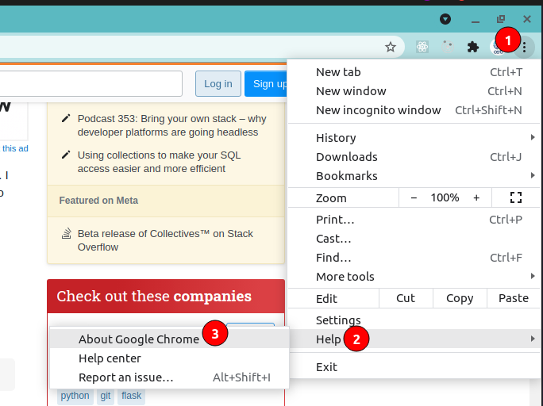
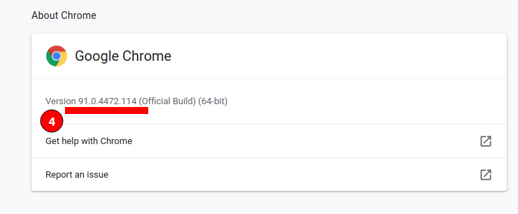
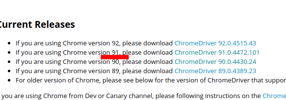
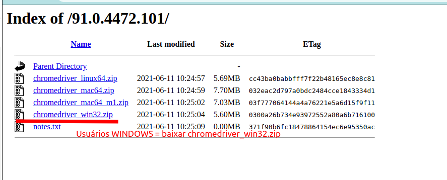
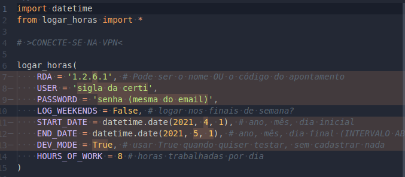

## Instalação

* Baixar esse repositório:
`git clone https://lucas_rhode@bitbucket.org/lucas_rhode_lrh/channel.git`
* Descobrir versão do Chrome:

* Baixar e instalar a extensão do Selenium para o chrome (conferir com a versão que você viu acima):
[https://sites.google.com/a/chromium.org/chromedriver/downloads](https://sites.google.com/a/chromium.org/chromedriver/downloads)

* Instalar extensão Python:
pip install selenium
* Inserir suas informações de login no arquivo `main.py`

🎉 Pronto! Pode dale, o Script está pronto para ser executado 🎉

`python main.py`